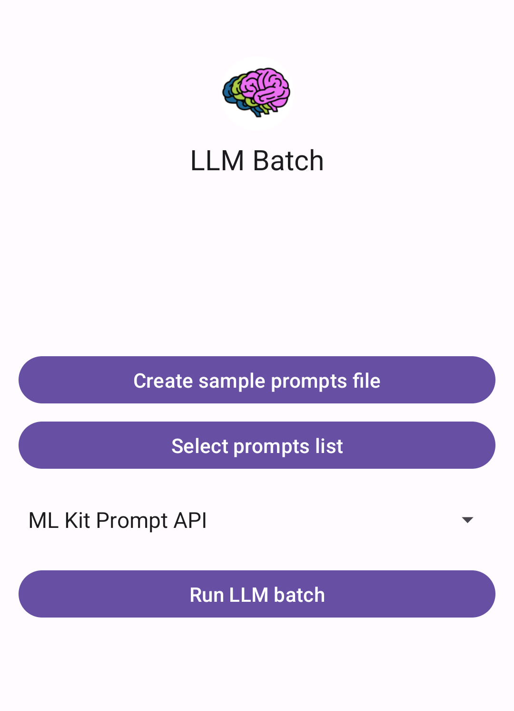

# LLM Batch

An Android application for batch processing prompts through various Large Language Models (LLMs), both local and cloud-based.

Thanks to using the local model already embedded in recent Android phones, the app is less than 25 megabytes.

## What is LLM Batch?

LLM Batch allows you to process multiple prompts through AI models efficiently. Instead of manually sending prompts one by one, you can:

- **Prepare a text file** with multiple prompts (one per line)
- **Select an AI model** (local on-device or cloud-based)
- **Run batch processing** to get all responses at once
- **Export results** as a CSV file with prompts, responses, and timing data

## Use Cases

**Perfect for**:
- Developers who are considering using embedded AI and want to properly evaluate its capabilities on a large number of examples.
- Researchers studying embedded AI characteristics.
- Anyone with a need to run many prompts at a low cost.
- Anyone with a need to run prompts without technical hassles nor heavy downloads, simply by installing a lightweight application.
- Anyone with a need to run prompts without being dependent on Internet connection.

### Research & Analysis
- Test how different models respond to the same prompts
- Compare response times across models
- Analyze consistency in model outputs
- Conduct systematic prompt engineering experiments

### Testing & Evaluation
- Benchmark model performance
- Test prompt variations systematically
- Quality assurance for AI-powered features
- On-the-fly dataset creation for fine-tuning

### Education & Learning
- Study AI model behavior patterns
- Compare local vs cloud model performance

## Supported Models

### Local Models (On-Device)
1. **ML Kit Prompt API** - Google's on-device generative AI, using your device's already embedded Gemini Nano (v3 on Pixel 10, v2 or Pixel 9)
2. **Edge AI SDK** - Similar previous SDK, also using on-device Nano.

### Cloud Models
3. **Gemini 2.5 Flash Lite API** - Google's cloud-based model (requires API key)

## Features

- **Simple Interface** - Clean, intuitive UI for selecting files and running batches
- **Progress Tracking** - Real-time progress updates during processing
- **CSV Export** - Results saved with prompt, response, and timing information
- **Sample Generator** - Create sample prompt files to get started quickly
- **Error Handling** - Automatic retry logic for busy models
- **Stop Control** - Cancel processing at any time

## Getting Started

1. **Install the app** on your Android device (requires Android 14+)
2. **Create or select a prompts file**:
   - Use the "Create sample prompts file" button, or
   - Prepare your own text file with one prompt per line
3. **Select prompts list** - Choose your prompts file
4. **Select a model** from the dropdown
5. **Run LLM batch** - Choose where to save the results
6. **Wait for processing** - Monitor progress in real-time
7. **View results** - Tap the results link to open the CSV file

## CSV Output Format

The results file contains three columns:
- **Prompt** - The original prompt text
- **Response** - The model's generated response
- **Time** - Processing time in milliseconds

## Technical Details

- Built with Kotlin and Android Jetpack
- Uses ViewBinding for UI management
- Coroutines for asynchronous processing
- FileProvider for secure file sharing
- Exponential backoff for on-device model rate limiting

## Privacy & Performance

- **Local models** process entirely on-device - no data sent to cloud
- **Cloud models** send prompts to Google's servers
- Processing time varies by model and device capabilities, usually half a second per local prompt.
- Results are saved to user-selected locations only

## Contributing

This is an open-source project. Contributions, issues, and feature requests are welcome!

